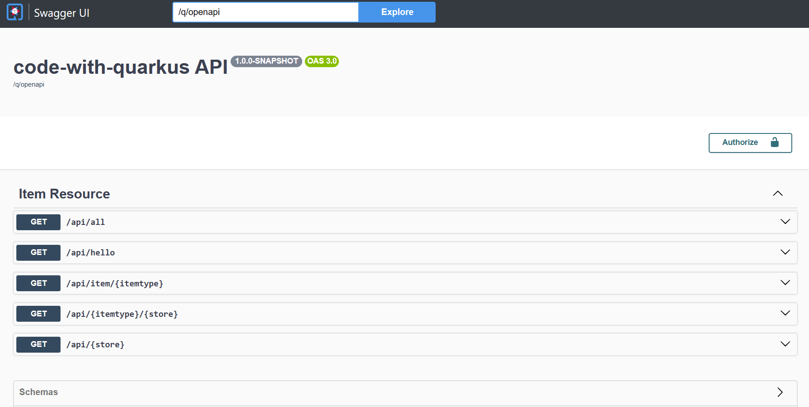
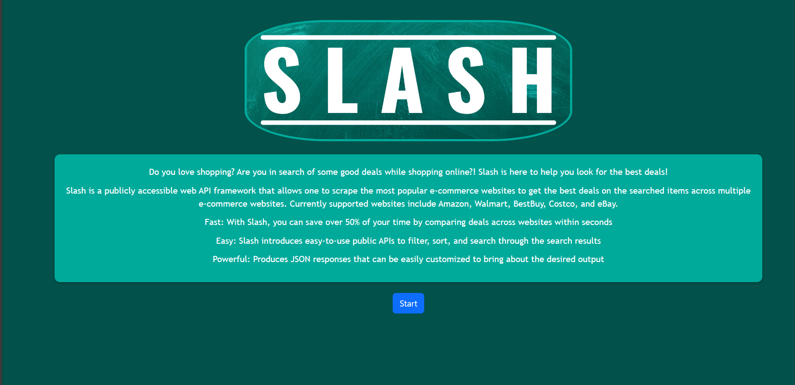
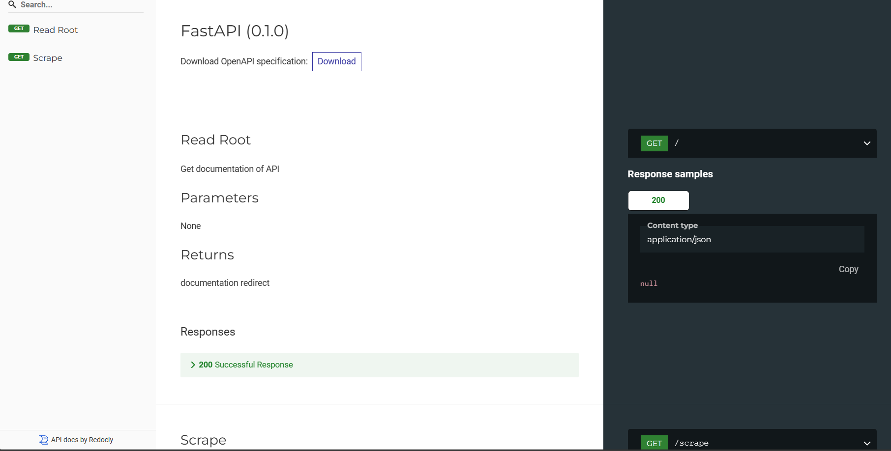

<p align="center">Welcome to Slash: Your Ultimate Shopping Companion!</p> 
<p align="center"></p>


[](https://zenodo.org/badge/latestdoi/431326985)


[](https://github.com/SE-Fall2023-Group-41/SlashV2/actions/workflows/node.js.yml)
[](https://github.com/SE-Fall2023-Group-41/SlashV2/actions/workflows/python-app.yml)
[](https://app.codecov.io/gh/SE-Fall2023-Group-41/SlashV2)

Do you love shopping? Are you in search of some good deals while shopping online?! Slash is here to help you look for the best deals!
Discover the latest deals and discounts from your favorite e-commerce websites with Slash.
<br>We've simplified the way you shop online, making it faster, easier, and more powerful than ever before.<br>
🌟 Key Features<br>
Save Time: Slash helps you find the best deals on your desired items across multiple popular e-commerce websites.<br>
User-Friendly APIs: We offer simple and intuitive public APIs, allowing you to filter, sort, and search through search results effortlessly.<br>
Customizable Output: Slash provides JSON responses that you can easily customize to match your specific needs and requirements.
🛒 Supported Websites<br>
Slash currently supports the following major e-commerce websites:

- [Walmart](https://www.walmart.com/)
- [BestBuy](https://www.bestbuy.com/)
- [Costco](https://www.costco.com/)
- [Amazon](https://www.amazon.com/)


Table of Contents:
1. [Improvements](#Improvements-over-the-Previous-project)
2. [Getting started](#Getting-Started)
  - [Video](#Checkout-our-video)
  - [Installation](#Installation)
  - [Alternatively Running with Docker](#Alternatively-Running-with-Docker)
3. [Some handy links](#Some-handy-links)
4. [Technology Used]
5. [Screenshots](#Sort-and-Search-Snapshots)
6. Use Case
7. Why
8. Future Roadmap
9. Team Members
10. Support

## :rocket: Improvements over the Previous project

We have added a lot of new features to slash in this phase

Here's the improved version with corrected grammar and structure:

1. Authentication: With Auth0, users can log in using their own accounts.

https://github.com/michaeldacanay/SlashV2/assets/62859405/c029e3a2-349c-4492-8bb4-60f9dac645d4

2. History: Users can now view their search history from the past.


https://github.com/michaeldacanay/SlashV2/assets/62859405/e7c9f5d4-c67d-4801-8523-708b43fae949


3. Wishlist: Users will have a wishlist to save items they are interested in. There also a pop up window show you success added the item.


https://github.com/michaeldacanay/SlashV2/assets/62859405/8c04d94c-8bcf-4a28-b5d0-fff760c7550c


4. Navigation Bar: Users can navigate to the desired page by simply clicking on the page name in the navigation bar. The navigation bar will be different if the user is logged in.


https://github.com/michaeldacanay/SlashV2/assets/62859405/beecbb80-0edb-40e7-b44c-8c858c2755c5


5. Background Color: We added a dropdown menu in the top right corner so users can change the background color to their preference.

https://github.com/michaeldacanay/SlashV2/assets/62859405/f038aba0-66a8-4bd9-b3ab-d8d661214e7b

6. Logo showing: Unlike the previous project, we have replaced store names like Walmart and Amazon with their logo images, scraped in our project. This addition allows users to view product images alongside other information, providing a more comprehensive and engaging experience.


https://github.com/michaeldacanay/SlashV2/assets/62859405/bb5fec81-29f9-4c01-8a96-47f314bdb9c3


7. Filtering: We've empowered users with filter options based on prices and product names. Now, users can find items with keywords and within a certain price range.


https://github.com/michaeldacanay/SlashV2/assets/62859405/e4da4024-57eb-4016-914a-d4e2ed5dbe88


8. Currency: We've implemented another column for users to see prices in other currencies. The drop down menu is no show in the video but in the app. 


https://github.com/michaeldacanay/SlashV2/assets/62859405/5f351e27-8965-4163-b59e-8cac3ecce6c2


9. Fixed Scraper: The previous project had an infinite loop while waiting for the scraping of new items.
10. Other UI Changes: Added currency symbols, changed to the corresponding currency when users select a different currency, added borderlines around each column and row, and made the slash symbol a round one for a better appearance. Changed the Paginator to show the current page and the max page. Changed the style of the home page.
---

Get ready to supercharge your shopping experience with Slash!
# 🚀 Getting Started
Slash is open-source and ready for you to explore. Here's how to begin:

<p align="center">
  <a href="#movie_camera-check out-our-video">Checkout our video</a>
  ::
  <a href="#rocket-installation">Installation</a>
  ::
  <a href="#computer-technology-used">Technology Used</a>
  ::
  <a href="#bulb-use-case">Use Case</a>
  ::
  <a href="#page_facing_up-why">Why</a>
  ::
  <a href="#golf-future-roadmap">Future Roadmap</a>
  ::
  <a href="#email-support">Support</a>
</p>

---

## :movie_camera: Checkout our video

https://github.com/SE-Fall2023-Group-41/SlashV2/assets/62643830/02359bf0-1d6b-43cd-93bb-f331589b9aa3

---

## :rocket: Installation

Prerequisites:

- Install [Python 3](https://www.python.org/downloads/) for scraper and [Pip](https://pip.pypa.io/en/stable/installation/). To verify, run `python --version` or `python3 --version`. Likewise, for pip: `pip --version` or `pip3 --version`
- Install [Node 20+](https://nodejs.org/en/) for node and npm package manager for [React](https://react.dev/) framework for the frontend. To verify, run `node --version`.
- Install [Docker](https://www.docker.com/get-started/). Open Docker Desktop and make sure it is running.
- Install [JDK 17](https://www.oracle.com/java/technologies/javase/jdk17-archive-downloads.html) for [Quarkus](https://quarkus.io/) for the backend. To verify, run `java --version`.


1. Clone the Github repository to a desired location on your computer. You will need [git](https://git-scm.com/) to be preinstalled on your machine. Once the repository is cloned, you will then `cd` into the local repository.

```
git clone https://github.com/michaeldacanay/SlashV2.git
cd SlashV2
```

2. We use Python 3 for the scraper, located in the src folder. All the Python requirements of the project are listed in the `requirements.txt` file. It is suggested to first create a virtual environment before installing dependencies e.g. pipenv, venv, etc. Use pip to install all of those.

```
cd src

# suggested to create virtual environment
# e.g. pipenv
#
# brew install pipenv
# pipenv --python 3.10
# pipenv shell

pip install -r requirements.txt (OR pip3 install -r requirements.txt)
```

3. Run the scraper, using the python command to run the main.py file.

```
# in src
python main.py (OR python3 main.py)
```

4. For the backend setup ensure that JDK 17 is preinstalled, you will have to cd into the backend. Once in the backend folder, use the command mvnw.cmd

```
cd backend

./mvnw compile quarkus:dev  # For Mac
mvnw.cmd quarkus:dev        # For Windows
```

5. For the frontend setup to ensure that Node 20 is preinstalled, you will have to cd into the frontend. Once in the frontend folder, add a .env.development.local file with `REACT_APP_API_URL=http://localhost:8080/api/` environment variable. Then, use the command `npm start`

```
cd frontend
npm install

# .env.development.local (add if not present)
# REACT_APP_API_URL=http://localhost:8080/api/

npm start
```

## Alternatively Running with Docker

To run the application using Docker, follow these steps:

1. Navigate to the `backend` directory:

   ```
   cd backend
   ```

2. Build the backend application using Maven Wrapper:

   ```
   ./mvnw package

   ```

3. Return to the project root:
   ```
   cd ..
   ```
4. Start the Docker containers:
   ```
   docker-compose up
   ```

These commands above will run and build 4 containers locally.
<br>

## Some handy links:

<br>
Here are some handy links to access different aspects of the application:

[Swagger UI for Backend](http://slash-backend-ifjolla-dev.apps.sandbox-m3.1530.p1.openshiftapps.com/q/swagger-ui/): Explore the API using the Swagger UI, where you can experiment and interact with the backend. Below is a snapshot

<p align="center"></p>

[OpenAPI Specification](http://slash-backend-ifjolla-dev.apps.sandbox-m3.1530.p1.openshiftapps.com/q/openapi): Access the OpenAPI specification for a detailed description of the API endpoints.

[Slash Web Application](http://slash-frontend-ifjolla-dev.apps.sandbox-m3.1530.p1.openshiftapps.com/): Visit the Slash web application by clicking on this link. Below is a snapshot

<p align="center"></p>

[Scraper Exposed URL](http://slash-scraper-ifjolla-dev.apps.sandbox-m3.1530.p1.openshiftapps.com/): Access the scraper's exposed URL.

<p align="center"></p>

[PublicDockerImages](https://quay.io/user/ifjollancsu/): Find our public repositories on Quay.io, where you can conveniently use Docker images without the need to build them from scratch.

<p align="center"></p> 
Feel free to explore these links to access different components of the application and make the most of its features.

## :computer: Technology Used

- FastAPI : https://fastapi.tiangolo.com
- Docker : https://www.docker.com
- Quarkus: https://quarkus.io/
- Openshifts: https://docs.openshift.com/

## :file_cabinet: Sort and Search Snapshots

<p align="center">Shows the search function for query laptops</p>

https://github.com/SE-Fall2023-Group-41/SlashV2/assets/62643830/3104485a-2e9b-4259-826d-f163e25f6d33

<p align="center">Opens a link of the laptop we are interested to buy</p>

https://github.com/SE-Fall2023-Group-41/SlashV2/assets/62643830/b567edbc-337e-47e4-90a4-57e603b0774b

<p align="center">Sorts by website</p>

https://github.com/SE-Fall2023-Group-41/SlashV2/assets/62643830/6db1838e-8ef3-4e27-92e6-e870b8774e91

## :bulb: Use Case

- **_Students_**: Students coming to university are generally on a budget and time constraint and generally spend hours wasting time to search for products on Websites. Slash is the perfect tool for these students that slashes all the unnecessary details on a website and helps them get prices for a product across multiple websites.Make the most of this tool in the upcoming Black Friday Sale.
- **_Data Analysts_**: Finding data for any project is one of the most tedious job for a data analyst, and the datasets found might not be the most recent one. Using slash, they can create their own dataset in real time and format it as per their needs so that they can focus on what is actually inportant.

## :page_facing_up: Why

- In a market where we are spoilt for choices, we often look for the best deals.
- The ubiquity of internet access has leveled the retail playing field, making it easy for individuals and businesses to sell products without geographic limitation. In 2020, U.S. e-commerce sales, receiving a boost due to the COVID-19 pandemic, grew 44% and represented more than 21% of total retail sales, according to e-commerce information source Internet Retailer.
- The growth of e-commerce has not only changed the way customers shop, but also their expectations of how brands approach customer service, personalize communications, and provide customers choices.
- E-commerce market has prompted cutthroat competition amongst dealers, which is discernable through the price patterns for products of major market players. Price cuts are somewhat of a norm now and getting the best deal for your money can sometimes be a hassle (even while online shopping).
- This is what Slash aims to reduce by giving you an easy-to-use, all-in-one-place solution for finding the best deals for your products that major market dealers have to offer!
- Slash in its current form is for students who wish to get the best deals out of every e-commerce site and can be used by anyone who is willing to develop an application that consumes these web APIs.
- Future scope includes anything from a web application with a frontend or any Android or IOS application that utilizes these Web APIs at their backend. Anyone can build their own custom application on top of these web APIs.

## :golf: Future Roadmap

- Chrome Extension using the functionalities of Slash API
- An iOS or Android application.
- Add a login feature to store user history to provide features like bookmarking, price drop alerts, and many more.
- Use the stored history to provide personalized product recommendations and deal alerts based on user preferences.

## Team Members

- [Michael Dacanay](https://github.com/michaeldacanay)
- [Logan Williams](https://github.com/LoganWilliams1)
- [Xiaochun Liang](https://github.com/1360119047)

## :email: Support

For any queries and help, please reach out to us at: SEslash0041@gmail.com
Let Slash be your shopping sidekick and embark on a savings adventure like never before!
